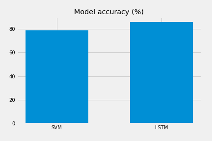

# Task 2 Report

AAU Machine Learning  
Author: Junel R.S. Solis

# Introduction

The main goal of this task was to perform a sentiment analysis on a large dataset of tweets using two different machine learning models. Selection of the models to be used is up to the creator to choose from. They should be tuned to get the best output and their performance should be compared.

The goal of tweet sentiment analysis is, given the contents of a tweet, to predict whether it has a **positive** or a **negative** sentiment. The models presented in this task should be able to predict any given tweet's sentiment with a reasonable amount of accuracy.

In this exercise, two models have been selected:

- Support Vector Machine (SVM) with term frequency - inverse document frequency (TF-IDF) vectorization
- Long Short-Term Memory (LSTM) recurrent neural network combined with GloVe Twitter vectors.

# Data Processing

The dataset is a subset of the Sentiment140 dataset from Stanford University containing 1.6 million samples. The actual dataset provided for this task contained a fraction of the total samples - 160,000. This dataset contained two columns: _tweet_text_ and its corresponding _sentiment_label_. The _tweet_text_ column contained the original tweet including hashtags, RTs, mentions, emojis, HTML code and URLs.

### Cleaning

There were some tweets that exceeded the traditional Twitter character limit of 140. While Twitter now allows tweets to be up to 280 characters, the decision was made nevertheless to drop rows exceeding 140 characters from the dataset. The sample size was randomly reduced to 70,000 samples to reduce processing and training times. The _sentiment_label_ rows were converted to either **[0,1]**

Some tweets contained encoded HTML in the form of **`&amp;`** and **`&quot;`** which appeared quite significantly in a word cloud of both the positive and negative tweets. These were decoded into their real-character strings **&** and **"** respectively. Some experimentation was done with lemmatization and stemming of entire sentences, but these did not seem to have a positive effect in the testing performance of either model.

Further cleaning of the **tweet_text** rows included the following:

- Removal of punctuations and numbers
- Conversion to lowercase
- Removing multiple spaces
- Removal of words longer than 41 characters

Spelling correction was attempted but eventually abandoned because of the memory requirements.

### Vectorization

Two vectorization methods were chosen selected:

- Term frequency - inverse document frequency (TF-IDF) vectorization
- Global Vectors for Word Representation (GloVe)

TF-IDF is commonly used in natural language processing (NLP) workflows while GloVe is an unsupervised learning algorithm that provides already vectorized data against which a dataset can be compared.

# Modelling

The choice to use an SVM classifier and an LSTM recurrent neural network was based on information in the course pages and Internet searches regarding twitter sentiment analysis and natural language processing.

It was quite simple to vectorize the SVM dataset with 2000 maximum features and fit the model using the Keras API.

While an SVM classifier is relatively simple, an LSTM network is much more complex in that its node layers not only pass information forward but also have mechanisms to provide recurrent feedback to previous layers. Hyperparameter tuning was also performed on the LSTM network using the Keras Tuner API in order to help derive optimum values for the number of units in the RNN layers, learning rate and dropout rates.

# Results

The SVM classifier model achieved an accuracy of ~76.6% with minimal time elapsed for fitting the data. In contrast, the accuracy of the LSTM model was significantly higher at ~84.9%. A graph comparing the model accuracies the comparison is shown below.

During training it was also observed that validation loss started to increase and validation accuracy started to decrease around 6 epochs and therefore the training epochs was limited to this number. The model architecture is also shown below.

✅
❌

### LSTM test with select tweets

# Discussion

Lack of experience was a major bottleneck in accomplishing this task, but it was an opportunity to learn about natural language processing and how vectorization is required in order for text content to be fed into machine and deep learning algorithms. In this regard, a very significant portion of time was used in researching the two models used as well as the concepts surrounding text vectorization.

Because of its nature, language data is highly variable and requires one to examine the raw dataset more fully in order to identify patterns early on that offer a possibility for correction or normalization. An example of this were the encoded HTML present in the tweets. Decoding that HTML afforded a small increase in accuracy for both models.

# Conclusions

The SVM classifier model's accuracy of **~76.6%** was outperformed by the LSTM model with its **~84.9%** accuracy. A secondary conclusion that may be made is that considerable amounts of time must be spent fine-tuning a model's settings as well as in data preprocessing in order to get consistent and reliable predictions.
